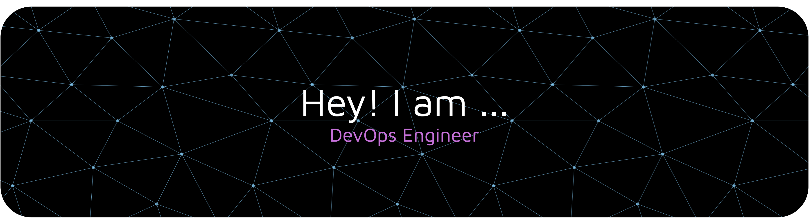

  

# Hi there, I'm Ankul 👋

## DevOps/SRE Engineer | Infrastructure Automation | Cloud & Kubernetes Specialist

🚀 Building scalable monitoring solutions with **Prometheus, Grafana & Kubernetes**  
🌍 **Open to remote opportunities in the US** (Experienced with async collaboration)  
💼 DevOps Engineer with ** Years production experience** + Android platform engineering background  
🔧 Specialized in infrastructure automation, observability, and cloud-native technologies  

---

## 🛠️ Core DevOps & Infrastructure Skills

**Container Orchestration & Virtualization:**  

**Cloud Platforms:**  

**Infrastructure as Code:**  

**CI/CD & Automation:**  

**Monitoring & Observability:**  

**Version Control & Collaboration:**  

**Scripting & Programming:**  

**Operating Systems:**  

---

## 💼 What I'm Working On

- 📊 **eSignatures Monitoring System**: Built comprehensive API monitoring with Prometheus & Grafana for vendor tracking and SLA compliance
- ☸️ **Kubernetes Multi-Environment Deployment**: Unified staging and production cluster management with automated scaling
- 🔄 **CI/CD Automation**: Implementing GitHub Actions pipelines for automated testing and deployments
- 📚 **AWS Solutions Architect**: Expanding cloud expertise for enterprise-grade infrastructure
- 🏗️ **Infrastructure as Code**: Terraform modules for GCP resource provisioning and management

---

## 🚀 Key Competencies

- ☸️ **Kubernetes Management**: Multi-environment cluster orchestration, deployment strategies, resource optimization
- 📊 **Observability**: Full-stack monitoring with Prometheus/Grafana, custom metrics, alerting, dashboard design
- 🔄 **CI/CD Pipelines**: Automated build, test, and deployment workflows with GitHub Actions
- 🏗️ **Infrastructure as Code**: Terraform automation, state management, cloud resource provisioning
- 🔧 **Automation**: Script development for deployment automation and operational efficiency
- 🌐 **Cloud Architecture**: GCP infrastructure design, networking, security, and cost optimization
- 🔐 **Security & Compliance**: Infrastructure security best practices, secret management, RBAC
- 📈 **Performance Optimization**: Resource utilization analysis, scaling strategies, cost-efficiency

---

## 🎯 Remote Work Experience

✅ Async collaboration across distributed teams  
✅ Self-service monitoring dashboards for stakeholder transparency  
✅ Strong documentation practices with comprehensive READMEs  
✅ Remote-first tooling: Slack, GitHub, GCP Cloud Shell, remote debugging  
✅ Available for US time zone collaboration  

---

## 🔧 Systems Engineering Background

**Former Android Custom ROM Developer & Beta Tester**
- Beta testing for OnePlus and Xiaomi devices
- Deep Linux kernel and systems-level knowledge
- Hardware-software integration and performance optimization
- Low-level debugging at scale

This unique background gives me expertise in infrastructure reliability and systems-level troubleshooting that most DevOps engineers lack.

---

## 📊 GitHub Stats

---

## 📫 Let's Connect

📧 **Email:** ankulkumar233@gmail.com  
📍 **Location:** Delhi, India (UTC+5:30)  
🌐 **Available for:** Remote US positions with timezone flexibility  
 

---

⭐️ From [ankul-git](https://github.com/ankul-git) | Open to DevOps/SRE opportunities
